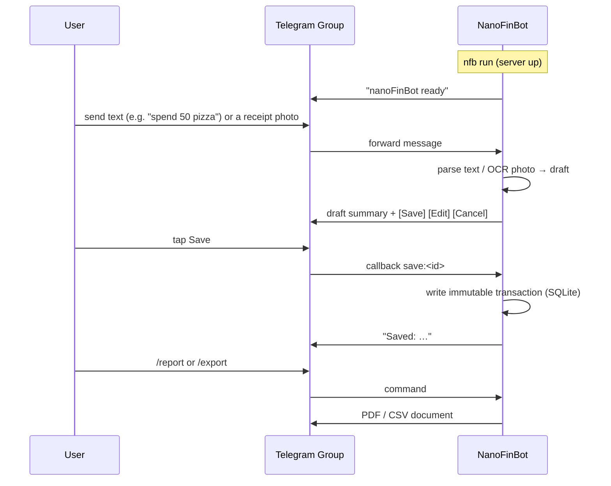

# nanoFinBot

On-demand Telegram finance bot. Snap a photo of a receipt or type a line of text,
confirm the draft, and nanoFinBot stores an immutable transaction row in SQLite.
No image or document is ever kept — only the extracted data.

## Flow



## Install (source)

```bash
git clone https://github.com/arinadi/nanoFinBot
cd nanoFinBot
python install.py
nfb setup
nfb run
```

## Setup: bot token and group

nanoFinBot only answers inside one Telegram group, so it needs a bot token and
that group's chat id.

1. Create the bot — open [@BotFather](https://t.me/BotFather) and send:

   ```
   /newbot
   ```

   Follow the prompts (name + username). BotFather replies with the **token** —
   keep it secret.

2. **Turn off group privacy** — bots by default only see commands, replies, and
   @mentions. nanoFinBot needs to read every message and photo. In BotFather send
   `/setprivacy`, pick your bot, and choose **Disable**.

3. Create the group — in Telegram, "New Group", add your bot to it, and make the
   bot an **admin** (so it can read messages).

4. Get the group chat id — chat with [@ScanIDBot](https://t.me/ScanIDBot) and
   follow its steps. Supergroups have a negative id (e.g. `-1001234567890`) — that
   is normal. Alternative: once the bot is running, just send `/chatid` in the group
   and it replies with the id.

5. Configure nanoFinBot:

   ```bash
   nfb setup
   ```

   It prompts for the token, then the group id. (For the Docker/proot images run
   `… setup` as shown in those sections instead.)

6. Start the bot (`nfb run`, or the Docker/proot equivalent). On start it posts
   `nanoFinBot ready` plus a provider status line in the group.

## Setup: provider and model

Text entry works out of the box (rules-only parser, no key needed). Photo OCR and
auto-categorization need an **OpenAI-compatible** provider. Configure it from the
group with a button menu — no config file editing:

1. In the group, send `/settings`.
2. Tap **Set text provider**.
3. Reply with three space-separated values:

   ```
   <base_url> <model> <api_key>
   ```

Examples:

- Gemini (cheapest for OCR):

  ```
  https://generativelanguage.googleapis.com/v1beta/openai/ gemini-2.5-flash <gemini-key>
  ```

- OpenAI:

  ```
  https://api.openai.com/v1 gpt-4o-mini sk-...
  ```

- Any other OpenAI-compatible server (local Ollama/vLLM, Groq, etc.) — just paste
  its base URL, model name, and key.

Optionally set a separate **image provider** the same way (tap *Set image provider*);
if you don't, photos use the text provider. Tap *Clear image provider* to revert to
that fallback. API keys are masked in the menu. The bot's startup status line
confirms whether the provider is ready.

## Run from the GHCR image

The image stores config and the SQLite database in `/config` and `/data`.
Mount both volumes so the database survives container replacement:

```bash
docker run -d \
  -v nanofinbot-config:/config \
  -v nanofinbot-data:/data \
  ghcr.io/arinadi/nanofinbot:latest
```

Run `nfb setup` inside a one-off container first to write the token/group id:

```bash
docker run --rm -it -v nanofinbot-config:/config ghcr.io/arinadi/nanofinbot:latest setup
```

## Run in proot-distro (Termux on Android)

proot-distro can pull the GHCR image directly — no Ubuntu install, no Docker, no
root. Config and the SQLite DB live inside the container's persistent filesystem
(`/config` and `/data`), so they survive restarts.

1. Install **Termux from F-Droid**, then install proot-distro:

   ```bash
   pkg install proot-distro
   ```

2. Install nanoFinBot straight from GHCR:

   ```bash
   proot-distro install ghcr.io/arinadi/nanofinbot:latest --name nfb
   ```

3. Configure the token and group id (runs the image's `nfb setup`):

   ```bash
   proot-distro run -u nanofinbot nfb -- setup
   ```

4. Start the bot (runs the image's default `nfb run`):

   ```bash
   proot-distro run -u nanofinbot nfb
   ```

The image runs as the non-root `nanofinbot` user; pass `-u nanofinbot` to match.
Long polling means no webhook URL is needed, so it works from any network.

## Documentation

- Plan (PRD, architecture, nanotasks): `nanoFinBot_plan/`
- Security/quality audit and fix plan: `docs/`
