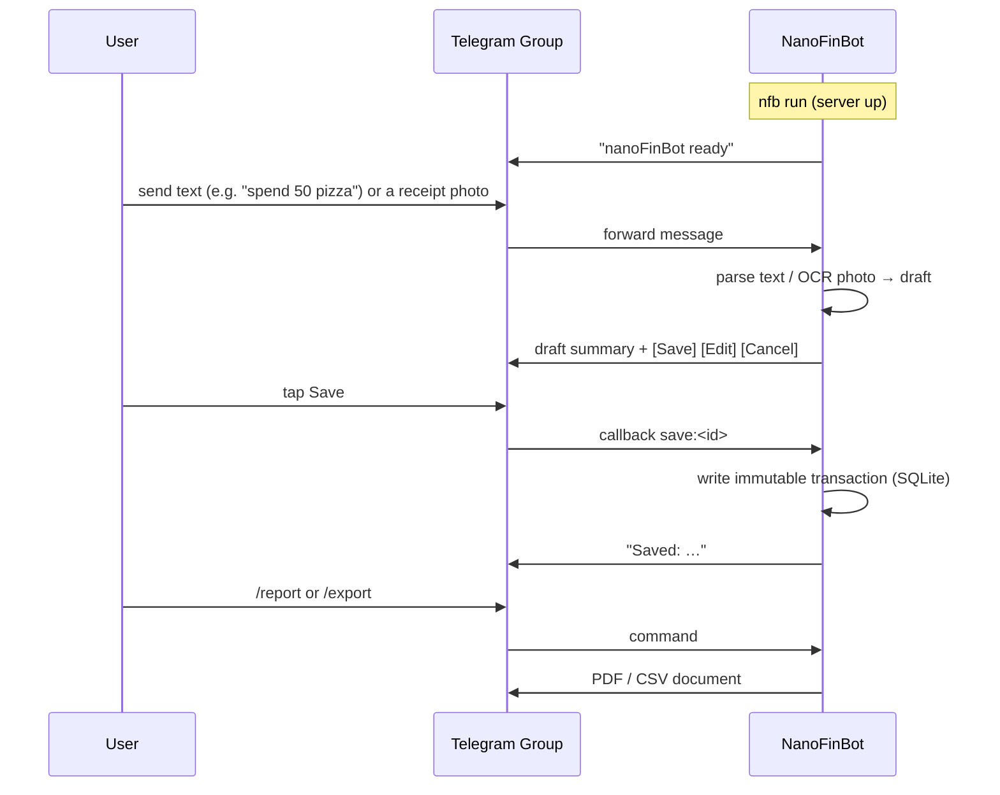

# nanoFinBot

On-demand Telegram finance bot. Snap a photo of a receipt or type a line of text,
confirm the draft, and nanoFinBot stores an immutable transaction row in SQLite.
No image or document is ever kept — only the extracted data.

## Flow



## Install (source)

```bash
git clone https://github.com/arinadi/nanoFinBot
cd nanoFinBot
python install.py
nfb setup
nfb run
```

## Run from the GHCR image

The image stores config and the SQLite database in `/config` and `/data`.
Mount both volumes so the database survives container replacement:

```bash
docker run -d \
  -v nanofinbot-config:/config \
  -v nanofinbot-data:/data \
  ghcr.io/arinadi/nanofinbot:latest
```

Run `nfb setup` inside a one-off container first to write the token/group id:

```bash
docker run --rm -it -v nanofinbot-config:/config ghcr.io/arinadi/nanofinbot:latest setup
```

## Run in proot-distro (Termux on Android)

proot-distro can pull the GHCR image directly — no Ubuntu install, no Docker, no
root. Config and the SQLite DB live inside the container's persistent filesystem
(`/config` and `/data`), so they survive restarts.

1. Install **Termux from F-Droid**, then install proot-distro:

   ```bash
   pkg install proot-distro
   ```

2. Install nanoFinBot straight from GHCR:

   ```bash
   proot-distro install ghcr.io/arinadi/nanofinbot:latest --name nfb
   ```

3. Configure the token and group id (runs the image's `nfb setup`):

   ```bash
   proot-distro run -u nanofinbot nfb -- setup
   ```

4. Start the bot (runs the image's default `nfb run`):

   ```bash
   proot-distro run -u nanofinbot nfb
   ```

The image runs as the non-root `nanofinbot` user; pass `-u nanofinbot` to match.
Long polling means no webhook URL is needed, so it works from any network.

## Documentation

- Plan (PRD, architecture, nanotasks): `nanoFinBot_plan/`
- Security/quality audit and fix plan: `docs/`
