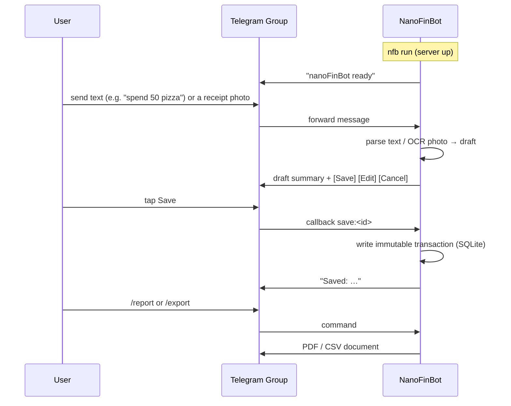

# nanoFinBot

On-demand Telegram finance bot. Snap a photo of a receipt or type a line of text,
confirm the draft, and nanoFinBot stores an immutable transaction row in SQLite.
No image or document is ever kept — only the extracted data.

## Flow



## Install

```bash
git clone <this-repo>
cd nanoFinBot
python install.py
nfb setup
nfb run
```

## Run from the GHCR image

The image stores config and the SQLite database in `/config` and `/data`.
Mount both volumes so the database survives container replacement:

```bash
docker run -d \
  -v nanofinbot-config:/config \
  -v nanofinbot-data:/data \
  ghcr.io/<owner>/nanofinbot:latest run
```

Run `nfb setup` inside a one-off container first to write the token/group id:

```bash
docker run --rm -it -v nanofinbot-config:/config ghcr.io/<owner>/nanofinbot:latest setup
```

## Documentation

The full plan (PRD, architecture, tasks) lives in `nanoFinBot_plan/`.
