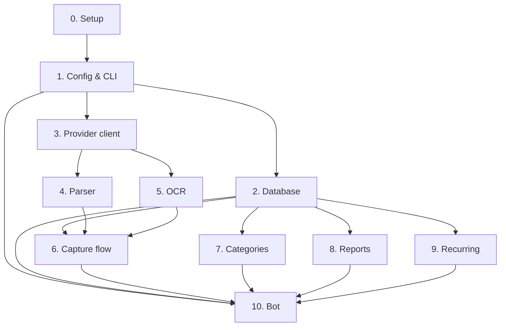

# Architecture: nanoFinBot

> Written by nanoPRD Phase 2. Source of truth for stack, data model, and structure.
> Nanotasks reference this file rather than restating it.

## 1. Tech stack

| Layer | Technology | Version | Inherited or new | Why |
|---|---|---|---|---|
| Runtime | Python | 3.12.x | new | Alpine 3.20 default; stable |
| Telegram framework | aiogram | 3.x | new | async Bot API, long polling, inline-button menus |
| LLM/OCR client | openai | 1.x | new | one OpenAI-compatible client covers OpenAI, Gemini-compat, and local servers (context Q9) |
| Database driver | aiosqlite | 0.20.x | new | async SQLite access without blocking the bot loop |
| PDF + charts | reportlab | 4.x | new | pure-Python (no native deps → Alpine-safe), built-in charts |
| Image preprocessing | Pillow | 10.x | new | downscale/deskew photos before OCR (cuts token cost, arch §5 risk 5) |
| Config paths | platformdirs | 4.x | new | cross-platform config/data dirs (Windows + Linux/proot) |
| CLI / config / CSV / DB | argparse, json, csv, sqlite3 (stdlib) | — | new | no extra deps for `nfb` subcommands, config, export |
| Tests | pytest, pytest-asyncio | 8.x, 0.24.x | new | validation commands in every nanotask |

One dependency note: `openai` is the **only** LLM/OCR SDK. There is no separate Gemini or vision SDK — the configurable `base_url` points the same client at any provider (context Q8–Q9). No local OCR/ML libraries are used, so Alpine's musl limitation is irrelevant.

## 2. Data model

All amounts are stored as **integer minor units** (e.g. 12,500 IDR = `12500`) plus an ISO 4217 currency code; a static `CURRENCIES` map (code → minor exponent, symbol) drives formatting. This keeps multi-currency exact with no float arithmetic and no conversion.

| Entity | Key fields | Relationships | Storage |
|---|---|---|---|
| Transaction | `id`, `amount_minor` (int), `currency` (ISO), `type` (expense/income), `description`, `category_id`, `source` (photo/text), `status` (draft/active/disabled), `created_by` (tg user), `created_at` | `category_id` → Category | SQLite `transactions` |
| Category | `id`, `name`, `created_at` | one → many Transaction | SQLite `categories` |
| RecurringItem | `id`, `description`, `amount_minor`, `currency`, `type`, `category_id`, `frequency` (daily/weekly/monthly/yearly), `next_due`, `active` | `category_id` → Category | SQLite `recurring` |
| Config | `telegram_token`, `group_id` (nullable), `default_currency`, `timezone`, `provider{base_url,model,api_key}`, `image_provider{base_url,model,api_key}` (nullable) | none | JSON file via platformdirs |

**Transaction lifecycle** (context Q5, Q14): `draft` (pending confirmation, editable) → `active` (saved, immutable) or dropped. `active`/`disabled` rows are immutable — `disabled` only toggles report inclusion. Drafts persist in the DB so an on-demand restart resumes the queue instead of dropping photos (arch §5 risk 4).

**Config** holds secrets (API keys) in plaintext in the user's config dir. Accepted tradeoff for a self-hosted single-operator bot; no key is ever logged.

## 3. Components

| # | Component | Responsibility | Depends on |
|---|---|---|---|
| 0 | Setup | `pyproject.toml`, `install.py`, Dockerfile, GHCR build workflow | none |
| 1 | Config & CLI | `nfb` entrypoint, `setup` subcommand, config read/write, platformdirs paths | 0 |
| 2 | Database | SQLite schema (WAL), async repository for transactions/categories/recurring | 1 |
| 3 | Provider client | OpenAI-compatible text + vision calls (text and optional image provider) | 1 |
| 4 | Parser | rules-based NL parsing (no key) + LLM categorization via provider client | 3 |
| 5 | OCR | photo download, Pillow preprocess, vision call → structured draft | 3 |
| 6 | Capture flow | draft queue, per-draft Save/Edit/Cancel, immutable save, disable | 2, 4, 5 |
| 7 | Categories | auto-create from parser/OCR, rename | 2 |
| 8 | Reports | PDF + CSV generation and Telegram delivery (one on-demand path) | 2 |
| 9 | Recurring | due-check logic, produce reminder events | 2 |
| 10 | Bot | aiogram dispatcher, long polling, startup status message, button menus, route inputs to 6/7/8/9 | 1, 2, 6, 7, 8, 9 |

## 4. Dependency graph

No cycles. Phase 3 orders nanotasks to match.

## 5. Risk chains

| Trigger | Immediate failure | Downstream effect | Mitigation |
|---|---|---|---|
| LLM/OCR returns malformed or non-schema JSON | parser cannot extract amount/category | draft shows wrong/empty fields, capture errors | validate output against a schema; on failure present an empty editable draft instead of erroring; rules-only parser always available for text |
| LLM/OCR provider down or key invalid (401) | every photo/NL capture fails | user cannot log anything | rules-only parser keeps text entry working; surface a distinct "provider auth error" state; config UI switches provider |
| Long-polling disconnect with drafts in memory | unconfirmed drafts lost | user's photos silently dropped on restart | drafts persist in DB with `status=draft`; startup resumes the queue |
| Large photo sent to OCR | many image tokens billed | cost surprise, user distrusts OCR | Pillow downscale to ≤768px grid and cap dimensions before sending; no image stored after processing |
| SQLite corrupts on abrupt kill | data loss | reports empty | WAL mode + checkpoint; DB stored in a persistent path outside the image rootfs; `nfb` backup copies the `.db` |
| Config file corrupt/lost | bot cannot start (no token) | status message never sent, install looks broken | atomic config write (temp + rename); validate on startup with a clear error; `nfb setup` re-runnable |

## 6. External integrations

| Service | Used for | Failure mode | Degradation strategy |
|---|---|---|---|
| Telegram Bot API | messaging, photos, inline buttons | unreachable / rate-limited | aiogram long-polling retries with backoff |
| OpenAI-compatible endpoint (text provider) | NL parsing, categorization | down / 401 / bad JSON | rules-only parser for text entry |
| Image provider (optional) | OCR of photos | down / 401 | fall back to the text provider, else manual entry |
